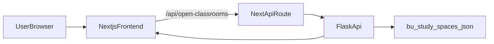

# Architecture

Study BUddy is a two-tier application: a Next.js frontend and a Flask backend
that serves study space data.

## High-level data flow

## Components

- **Frontend** (`frontend/`): Next.js app renders the map and list UI, calls the
  internal API route, and handles geolocation.
- **API route** (`frontend/app/api/open-classrooms/route.ts`): proxies requests
  to the Flask backend and shields the client from direct backend URLs.
- **Backend** (`backend/`): Flask app in `studybuddy_backend/` loads JSON data,
  computes availability and distance, and serves the API.
- **Data** (`backend/bu_study_spaces.json`): canonical study space dataset.
