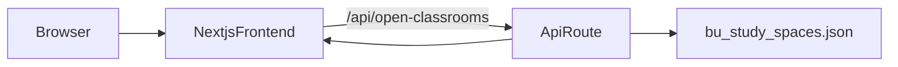

# Architecture

Study BUddy is a single-tier Next.js application that serves both the frontend UI
and the API route for processing study space data.

## High-level data flow

## Components

- **Frontend** (`frontend/app/`): Next.js app renders the map and list UI, calls the
  internal API route, and handles geolocation.
- **API route** (`frontend/app/api/open-classrooms/route.ts`): Self-contained route
  that loads JSON data, computes availability and distance, and returns building data.
- **Services** (`frontend/lib/`): TypeScript modules for availability status calculation
  (`availability.ts`) and distance calculation (`distance.ts`).
- **Data** (`frontend/data/bu_study_spaces.json`): Study space dataset bundled with
  the frontend.

## Legacy Backend

The `backend/` folder contains an optional standalone Flask API that provides the same
functionality. It can be deployed separately if needed, but for Vercel deployment the
self-contained Next.js API route is used.
